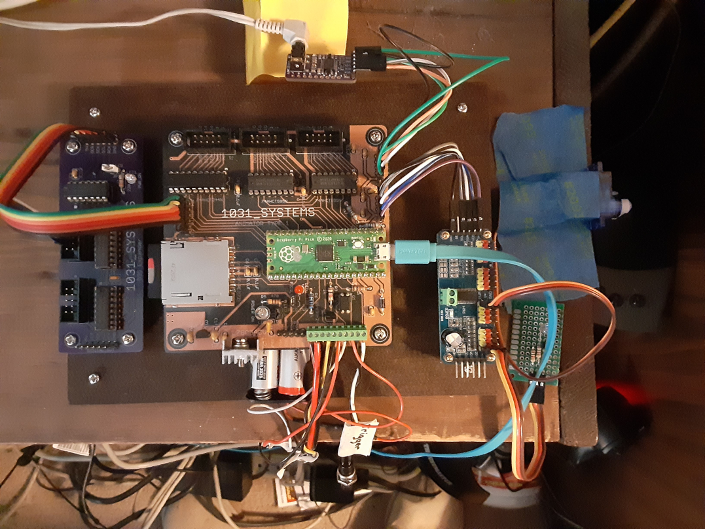

<!-- john Tue Apr  2 07:11:17 AM PDT 2024 -->
<!-- This software is made available for use under the GNU General Public License (GPL). 
-->
<!-- A copy of this license is available within the repository for this software and is 
-->
<!-- included herein by reference. -->

# Pico/Hardware

This directory contains design and fabrication files for the animatronics controller
board based on the Raspberry Pi Pico and extender boards.  The basic controller board
utilizes a Raspberry Pi Pico processor board (or clone thereof), an SD card slot for
extending memory, and two 74HC595 chips for 16 bits of digital output.  In addition,
there are various connectors and pinouts for triggers, status LEDs, I2S for audio
playback, I2C for servo control on extender boards, and serial output for additional
74HC595s on expander boards.  The files for the main controller board and the 74HC595
digital extender boards are contained herein.  The PCA9685 extender boards for servos
and other PWM controls are available commercially.

This hardware is made available for use under the GNU General Public License (GPL).  A 
copy of this license is available within the repository for this hardware and is included 
herein by reference.

## Introduction

The animation controller hardware described herein is intended to be assembled and used
by hobbyists or anyone interested in animatronics.  The user may have the boards fabbed
and stuffed so they are ready for use upon arrival, have the boards fabbed and then
solder the chips and other components themselves, or assemble the system on a protoboard
with point-to-point soldering.  The board design uses through-hole mounting, except for
the SD card socket, to make it easier for anyone to do their own soldering.

We went with the middle approach of having the boards fabbed and then doing the 
soldering ourselves.  The board is available through OSH Park, https://oshpark.com/shared_projects,
search for 1031_Systems.  The user may go there to order boards that they can then
stuff themselves.

## Warning

Electronics are tricky and expensive as are hobby servos, AC power can 
kill you, pneumatics are just flat out dangerous, you are responsible for the safety of 
your design and build and accept the responsibility of any injuries, damage or cost you 
may incur. 
 
## Board Design

The 1031_Systems Animator Type 1 board is built around the core of a Raspberry Pi Pico or 
exact Pico clone processor. The update rate for the numerical/servo and digital outputs 
is intended to be 50Hz.  There are 2 on board voltage regulators, one 1.5 Amp 5 Volt 
regulator to provide power to the Pico, the level shifted logic and power to peripherals,
and a 3.3 Volt 250 mA regulator for the I2C and I2S ports. There are two 74AHCT595 chips 
that provide level shifted (3.3 Volt logic levels to 5 Volt logic levels) for digital 
outputs and a single 74AHCT244 chip that buffers and level shifts 8 GP pins from the 
Pico. The pins that are buffered through the 74AHCT244 and be used as either binary (0V 
or 5V) on/off signal or numerical/servo signals. Two of the GP pins are left unbuffered 
but may be used as either binary or numerical/servo signals. The signals for both the I2C 
port and the I2S port are unbuffered. There is a screw type terminal block on the board, 
the signals brought out to the terminal block include: A status pin driving the base of a 
N-P-N transistor with the collector pin connected to the terminal block; An unbuffered 
trigger, needing only to be pulled to ground; The anode and cathode of an opto-isolator 
providing an optically isolated trigger; The unbuffered Run pin from the Pico; A 5 Volt 
output from the on board regulator and ground and input pins for powering the board. The 
board is 4 inches on each side, the center of the mounting holes are 0.25 inches from 
edge of the board and 3.2mm in diameter.

In this image of an example board, the main controller board is in the center and
measures 4"x4".  To the left is a 595 expander board containing two additional 8-bit
digital output blocks.  With the 16 digital outputs on the main controller board, this
gives a total of 32 digital outputs.  Additional expander boards may be cascaded to
support as many digital ports as needed.

To the right of the main board is a commercially available PCA9685 board
providing PWM control of up to 16 servos
or LED brightness controls.  These may also be cascaded to support the desired number of
PWM devices.  To the top is a sample I2S-compatible sound card to play
the audio portion of the animatronics.  To the bottom are the buttons that control the
playback of animations including reset of the Pico, start/stop trigger, and an opto-isolated
trigger to interface with various types of trigger devices.

## The Ten ports on the board 

1. JP1 the I2C port used for connecting the PCA9685 numerical/servo boards
2. JP2 the I2S digital audio port, several different PCM510x break out boards have been 
tested all worked, it is unknown at this time if other I2S chips work but it is expected 
they would.
3. J2 the lower 8 bits from the two cascaded 74AHCT595 chips, D0 - D7.
4. J3 the upper 8 bits from the two cascaded 74AHCT595 chips, D8 - D15.
5. J1 the 8 buffered Pico GP signals.
6. JP4 the output from the 74AHCT595 cascade, so other 74AHCT595 chips may be added.
7. J4 the SD card socket.
8. JP3 the 2 unbuffered Pico signals.
9. X1 the ten port screw terminal socket.
10. The USB connector on the Raspberry Pi Pico.

JP1, JP2, JP3 and JP4 are post type (pin header) connectors for connecting Dupont 
connectors.  J1, J2, and J3 are square receptacles for receiving 10 pin IDC ribbon cable connectors, 
although post type connectors may be used here if preferred. 
X1 has 10 signals on a 0.1-inch (2.54mm) pitch screw terminal. 

## Available Documents

The assigned pins for the Pico are in the Pico_Pinout.xls spreadsheet.

The connector pinouts are in the Board_Connections.xls spreadsheet.

The Bill of Materials for the board is in the Animator_Board_BOM.xls spreadsheet.

A copy of the schematic, the top silkscreen and the Gerber files is included.

## Best Practices

- Do NOT power servos from the 5volt regulator on the Animator board. The Regulator is 
only 1.5 amps and it is easy to draw way too much current.

- Put a heat sink on the 5volt regulator.

- Use the optically isolated trigger, it is just like turning on an LED, the short to 
ground trigger will end the animation the second time it is engaged, the optically 
isolated trigger will allow the animation to complete.
 
- The voltage used for most of the testing was 12 volts this is the preferred voltage, 
although the system should run successfully at any voltage between 9 and 24 volts.

- The best estimate is that the Animator board can support up to 64 servos and 96 outputs 
from 74AHCT595s at 50Hz. 

- In the directory .../Animatronics/Pico/lib is a file called tabledefs. This file must be 
edited to match the configuration of your animatronic system. Do not leave spaces in 
front of the first character of the configure595s or the addDigitalPortTableEntry or the 
addPWMPortTableEntry lines.  The tabledefs file can be loaded by running either
do_install or installtable command in the /Pico  directory.  Run the Python program 
tables.py to verify the tabledefs file is correct. table.py -v will print the 
configuration from the tabledefs file to the screen.

- There can be only one tabledefs file.

- You do not have to use an SD card.  Instead use a Pico clone with 16 megabytes and load
the animations and audio to the onboard flash memory to run just a few short animations.

## 595 Expander

A simple 595 expander board was designed and fabricated to allow for the addition of 
longer cascades of digital outputs. The output design is identical to the ouputs on the 
Animator board and are numbered D0 to D15.  When added to the tabledefs file the digital 
outputs would be D16 to D31. The board is available through OSH Park 
https://oshpark.com/shared_projects, search for 1031_Systems. The board is 4 by 1.5 
inches on each side, the center of the mounting holes are 0.25 inches from edge of the 
board and 3.2mm in diameter.

Note: There is an error on the silkscreen of this board:  
IC1 is labeled 74HC125N and should be labeled 74AHCT125N.

The Bill of Materials for the board is in the 595_Extender_BOM.xls spreadsheet.

A copy of the schematic, the top silkscreen and the Gerber files is included.

