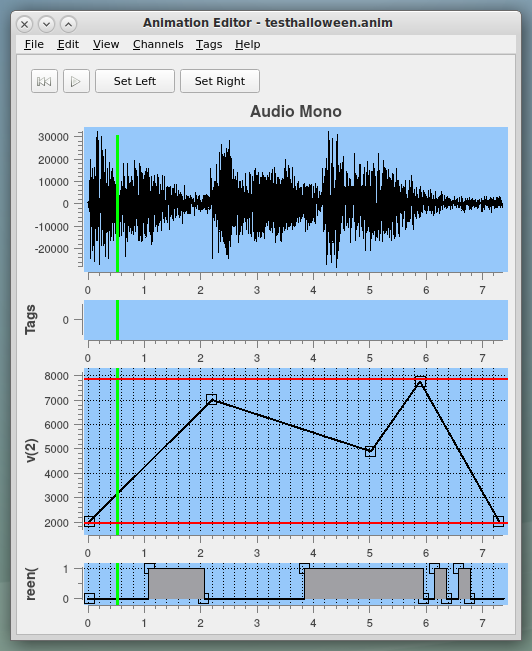

<!-- john Fri Dec 17 17:35:16 PDT 2023 -->
# Animatronics

Apologies for a lack of recent updates.  I was working on support
for the Pololu Maestro controllers, then I got injured and had to
stop for awhile, then it was time to roll out the first Halloween
animatronics, and then it was time for Christmas animatronics.  Now
that's over I will be incorporating some of the lessons I learned
working with Christmas music.  Thus, eventually there will be more
new stuff.  Demos of the Halloween animatronics are available at
our Youtube channel listed below.

This repo contains code and scripts for working with robotic
control data for animatronics.  It is designed to work with
board designs created by Bill Douglas and available for
download here in this repo at [Pico/Hardware](Pico/Hardware/).

This codebase contains an application, Hauntimator, for creating control
channel data for directing the animatronics and code for
executing on a Raspberry Pi Pico for performing the animations.
The Hauntimator application is intended to be board-agnostic so
users may develop code for different processors such as 
Arduino or other Raspberry Pi versions.

It also contains a utility application, joysticking.py, for recording
joystick actions into Hauntimator channels.

A Youtube channel is available that contains some 
[introductory videos](https://www.youtube.com/@1031-Systems-Animatronics)
on how to use the software.

This software is made available for use under the GNU General Public License (GPL).
A copy of this license is available within the repository for this software and is
included herein by reference.

***

## Description

The general procedure for working with animatronics is to
create control channels that may be synced to an audio stream.
The channels may act as step functions, linear paths, and
smoothed or spline paths.  Each channel is linked to a single
control on a controller.

Once the control channels have been created and validated to be
synchronized with the audio, they are installed on the control
hardware in flash memory or on an SD card.  Then the software
on the control board runs to perform the animations and play 
the audio.

***

## Installation

Note that I am
a code developer but not, by any stretch of the imagination, a
repo manager.  Sure hope everything works for you.  If it doesn't,
you are welcome to volunteer to fix it.  Drop me a line at:
SW dot 1031 dot Systems at gmail dot com.

## If You Are a User

These tools have been built and tested on Mint 22.1 and Rocky 9,
two distributions of linux, and on MacOS Sonoma 14.9, another
variant of linux.  It has had minimal testing under Windows.  It
ran.  However, none of the installation scripts work under Windows
so it will be necessary to follow the scripted steps manually.

To have a readily runnable version of the tools, download the zipped
release file of your choice from https://github.com/1031-Systems/1031_Delivery/releases,
navigating to the realease of your choice.  If you just want the
latest release, find the one labeled Latest.  It should be at
https://github.com/1031-Systems/1031_Delivery/releases/latest.

Once the zip file is downloaded, unzip it into the directory of
your choice.  Unzipping the file produces a directory named
1031_Hauntimator.  Navigate to that directory and run install.
The tools should be ready to run.

Note that the directory structure and file locations for the User
version are different from that for the Developer to avoid distractions
of source code and data files.  While most of the files are there,
it is not intended to be a development environment.

If you encounter any issues, the README in the unzipped release
will contain more information about getting started.

## If You Are A Developer

In general, you will need to clone this repo to your local host
or download the associated tar file and expand it.
Then, create a virtual environment for the code using venv and
activate it.  Then use pip to install the required libraries in
your virtual environment.  At this point you should be able to 
run Hauntimator.py.  The steps are as follows:

~~~

git clone git@github.com:1031-Systems/1031_Delivery.git
cd 1031_Delivery
python3 -m venv '.venv'
source .venv/bin/activate.$SHELL
pip install --upgrade pip
pip install -r ${OSTYPE}-requirements.txt
pip install pocketsphinx    # To support phonemes plugin
python ./Hauntimator.py

~~~

In addition, you may have to find the appropriate requirements file
for your system.  If the OSTYPE environment is set then you can use
the command above.  If not, you will have to replace it with the
appropriate OS type for your system.  If your system is not available,
then you have to manually install needed modules with the  following:

~~~

pip install PyQt5 # (or PyQt6==6.5, whichever will actually install)
pip install PythonQwt
pip install pygame
pip install rshell
pip install pocketsphinx    # To support phonemes plugin
pip freeze -l > ${OSTYPE}-requirements.txt # To save your own config

~~~

On darwin, the only MacOS test system I have, PyQt5 does not install
but PyQt6 does.  Meanwhile, on my Rocky 9 test system, PyQt5 installs
just fine whilst PyQt6 does not.  You will have to install whichever
works for you.  Hauntimator.py is written to work with either PyQt5 or
PyQt6.  However, when I updated my Mac to PyQt6.8, everything quit
working.  PyQt6 seems to be changing a lot with every release, especially
in the QMediaPlayer area which is used here.  Thus, it is recommended
that you install specifically PyQt6.5 for now.

***

## Details

### Hauntimator.py

Hauntimator.py is the visual user interface for creating and editing the
control channels.  It displays a stack of channels, typically with 
audio at the top, in which all channels display the same time range.
During audio playback, a red bar moves across all channels so that
the user may visually align behaviors between channels and the audio
track.

Step functions hold a continuous value for a time and then
switch to a different value.  A subset of these are only 0 or 1
and control on/off devices like lights.  Linear paths use a
set of knots specifying some values at certain times and the
path is linearly interpolated between knots.  Spline paths use
a similar set of knots but apply Lagrange interpolation between the
knots for a smoother motion of the controlled device.

Channel data may be exported to a CSV file to be transferred to an
external hardware controller.  In addition, a pipe may be used to
directly signal the controller from the system while it runs
Hauntimator.py.

### joysticking.py

joysticking.py is a GUI application for recording joystick actions into
Hauntimator channels.  It reads an animation file created by Hauntimator
and provides an interface for mapping joystick axes and buttons to
channels in the animation.  Then it enables recording of the joystick
actions into those channels, playback of the channels, and saving of
the animation file for Hauntimator to read.

### Pico

This installation includes files for using a Raspberry Pi Pico or
clone for your animatronics controller.  The provided software is in 
the Pico directory.  See the README there for more details.

In the Pico part of the repo there is a file named commlib.py.  This
is the interface library for Hauntimator.py to talk to the hardware.
In order for Hauntimator to load the right commlib, there should be a
symbolic link in the Animatronics directory to the appropriate
commlib.py file to support users developing controllers with other
hardware or programming languages.  commlib.py has the purpose of
decoupling Hauntimator from the hardware specifics.

Hauntimator's direct communication with the hardware is optional and
Hauntimator will function without commlib.  In this case, the audio and
control files will need to be transferred to the hardware via rshell,
thonny, direct copy to SD card, or other mechanism.  Hauntimator can
output the CSV control files locally for separate transfer and the
audio files must already exist on the system.

## Plugins

Hauntimator supports a simple form of plugins.  The plugin files are, of
course, installed in the plugins directory.  There is a small set of
functions supplied in plugins/Stock.py for relatively generic functions
that operate on channels.  Hauntimator checks all the .py files in the
plugins directory and incorporates any that follow the protocol.  See
the README in the plugins folder for more details.

This software is made available for use under the GNU General Public License (GPL).
A copy of this license is available within the repository for this software and is
included herein by reference.

***

Copyright 2025 John R. Wright, William R. Douglas - 1031_Systems
