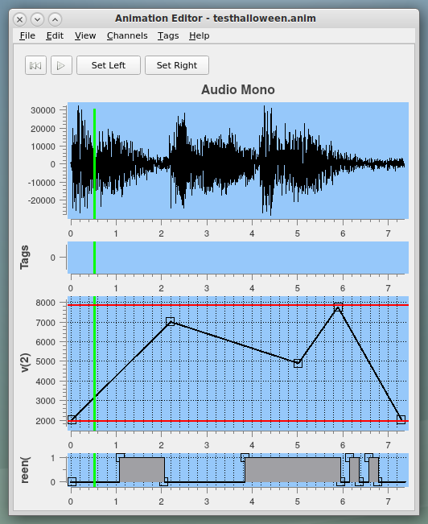

<!-- john Fri Jul 10 17:35:16 PDT 2026 -->
# Animatronics

We are pleased to announce that the tools in this repo are now available
for Windows 11.  In general, the Python code always worked but the
installation scripts were lacking.  That has changed.

This repo contains code and scripts for working with robotic
control data for animatronics.  It is designed to work with
board designs created by Bill Douglas and available for
download here in this repo at [Pico/Hardware](Pico/Hardware/).
However, it also supports Pololu Maestro animation controllers.

This codebase contains an application, Hauntimator, for creating control
channel data for directing the animatronics and code for
executing on a Raspberry Pi Pico for performing the animations.
The Hauntimator application is intended to be board-agnostic so
users may develop code for different processors such as 
Arduino, Pololu Maestro, or other Raspberry Pi versions.

It also contains a utility application, joysticking.py, for recording
joystick actions into Hauntimator channels.  If using Maestro controllers,
there is also the Maestro_Animator application for PC-based control
of the Maestros from Hauntimator output animations.

A Youtube channel is available that contains some 
[introductory videos](https://www.youtube.com/@1031-Systems-Animatronics)
on how to use the software.

This software is made available for use under the GNU General Public License (GPL).
A copy of this license is available within the repository for this software and is
included herein by reference.

***

## Description

The general procedure for working with animatronics is to
create control channels that may be synced to an audio stream.
The channels may act as step functions, linear paths, and
smoothed or spline paths.  Each channel is linked to a single
control on a controller.

Once the control channels have been created and validated to be
synchronized with the audio, they are installed on the control
hardware in flash memory or on an SD card.  Then the software
on the control board runs to perform the animations and play 
the audio.

***

## Installation

Note that I am
a code developer but not, by any stretch of the imagination, a
repo manager.  Sure hope everything works for you.  If it doesn't,
you are welcome to volunteer to fix it.  Drop me a line at:
SW dot 1031 dot Systems at gmail dot com.

## If You Are a User

These tools have been built and tested on Mint 22.1 and Rocky 9,
two distributions of linux, and on MacOS Sonoma 14.9, another
variant of linux.  It has also been tested under Windows 11, 
although not as extensively.  A very small number of features
appear to not be functional on Windows but are rarely used with
easy workarounds.

To have a readily runnable version of the tools, download the zipped
release file of your choice from https://github.com/1031-Systems/1031_Delivery/releases,
navigating to the release of your choice.  If you just want the
latest release, find the one labeled Latest.  It should be at
https://github.com/1031-Systems/1031_Delivery/releases/latest.
Look for the asset named Hauntimator_{version}.zip.

Once the zip file is downloaded, unzip it into the directory of
your choice.  Unzipping the file produces a directory named
1031_Hauntimator.  Navigate to that directory and run install or
wininstall.bat for Windows.  The tools will mostly be ready to run.
The full set of procedures for linux/MacOS and Windows are:

| linux/MacOS | Windows 11 |
|-------------|------------|
| Download zip file | Download zip file |
| Unzip zip file | Unzip zip file |
| cd 1031_Hauntimator | cd 1031_Hauntimator |
| ./install | .\\wininstall.bat |
| cd Pololu/lib | cd Pololu\\lib |
| edit tabledefs | edit tabledefs |
| cd .. | cd .. |
| ./do_install | .\\windo_install.bat |
| cd .. | cd .. |

To support the Pico Animator instead of Pololu Maestros, replace
Pololu with Pico.  To properly associate Pico or Pololu with Hauntimator
and other tools, a symbolic link is made in the src directory to the
appropriate commlib.py file under linux.  This is done in do_install.
On Windows, this requires Administrator
privileges so we do it differently with a small python file in src
named pointer.py that puts the appropriate directory in the python path.
This is created in windo_install.bat or winUsePololu/Pico in the
appropriate directory.

To simplify things, each release includes scripts for linux/MacOS and
Windows 11 to install Pico or Pololu code and implement all the above
steps as well as cleaning up unnecessary files.  You can download the
appropriate script for your system and run it standalone to completely
install the 1031 tools.  Be sure to copy or move it to the directory
where you want the installation to occur prior to running it.  You
can install in the Downloads directory if you wish.

The script installs a generic tabledefs file that might work for you
but in general you will need to edit the tabledefs file to customize
it for your application.

Note that the directory structure and file locations for the User
version are different from that for the Developer to avoid distractions
of source code and data files.  While most of the files are there,
it is not intended to be a development environment.

If you encounter any issues, the README in the unzipped release
will contain more information about getting started.

## If You Are A Developer

In general, you will need to clone this repo to your local host
or download the associated tar file and expand it.
Then, create a virtual environment for the code using venv and
activate it.  Then use pip to install the required libraries in
your virtual environment.  At this point you should be able to 
run Hauntimator.py.  The steps are as follows:

~~~

git clone git@github.com:1031-Systems/1031_Delivery.git
cd 1031_Delivery
python3 -m venv '.venv'
source .venv/bin/activate.$SHELL
pip install --upgrade pip
pip install -r ${OSTYPE}-requirements.txt
pip install pocketsphinx    # To support phonemes plugin
python ./Hauntimator.py

~~~

In addition, you may have to find the appropriate requirements file
for your system.  If the OSTYPE environment is set then you can use
the command above.  If not, you will have to replace it with the
appropriate OS type for your system.  NOTE that the requirements
files are not well maintained yet.  If your system is not available,
or doesn't work,
then you have to manually install needed modules with the  following:

~~~

pip install PyQt5 # (or PyQt6==6.5, whichever will actually install)
pip install PythonQwt
pip install pygame-ce
pip install rshell
pip install pocketsphinx    # To support phonemes plugin
pip freeze -l > ${OSTYPE}-requirements.txt # To save your own config

~~~

On darwin, the only MacOS test system I have, PyQt5 does not install
but PyQt6 does.  Meanwhile, on my Rocky 9 test system, PyQt5 installs
just fine whilst PyQt6 does not.  You will have to install whichever
works for you.  Hauntimator.py is written to work with either PyQt5 or
PyQt6.  However, when I updated my Mac to PyQt6.8, everything quit
working.  PyQt6 seems to be changing a lot with every release, especially
in the QMediaPlayer area which is used here.  Thus, it is recommended
that you install specifically PyQt6.5 for now.

Rocky 9 is Fedora-based while Mint is Ubuntu-based so we expect you
to have no issues on other related systems.

***

## Details

### Hauntimator.py

Hauntimator.py is the visual user interface for creating and editing the
control channels.  It displays a stack of channels, typically with 
audio at the top, in which all channels display the same time range.
During audio playback, a green bar moves across all channels so that
the user may visually align behaviors between channels and the audio
track.

Step functions hold a continuous value for a time and then
switch to a different value.  A subset of these are only 0 or 1
and control on/off devices like lights.  Linear paths use a
set of knots specifying some values at certain times and the
path is linearly interpolated between knots.  Spline paths use
a similar set of knots but apply Lagrange interpolation between the
knots for a smoother motion of the controlled device.

Channel data may be exported to a CSV file to be transferred to an
external animation controller.  In addition, a pipe may be used to
directly signal the controller from the system while it runs
Hauntimator.py.

### joysticking.py

joysticking.py is a GUI application for recording joystick actions into
Hauntimator channels.  It reads an animation file created by Hauntimator
and provides an interface for mapping joystick axes and buttons to
channels in the animation.  Then it enables recording of the joystick
actions into those channels, playback of the channels, and saving of
the animation file for Hauntimator to read.

### Pico

This installation includes files for using a Raspberry Pi Pico or
clone for your animatronics controller.  The provided software is in 
the Pico directory.  See the README there for more details.

In the Pico part of the repo there is a file named commlib.py.  This
is the interface library for Hauntimator.py to talk to the hardware.
In order for Hauntimator to load the right commlib, there MUST be a
symbolic link in the src directory to the appropriate
commlib.py file to support users developing controllers with other
hardware or programming languages.  commlib.py has the purpose of
decoupling Hauntimator from the hardware specifics.

Hauntimator's direct communication with the hardware is optional and
Hauntimator will function without commlib.  In this case, the audio and
control files will need to be transferred to the hardware via rshell,
thonny, direct copy to SD card, or other mechanism.  Hauntimator can
output the CSV control files locally for separate transfer and the
audio files must already exist on the system.

### Pololu

This installation also includes files for using Pololu Maestro
animation controllers.  The provided software is in the Pololu
directory.  See the README there for more details.

In the Pololu subdirectory, there is a file named commlib.py.  This
is the interface library for Hauntimator.py and Maestro_Animator.py 
to talk to the hardware.
In order for these tools to load the right commlib, there MUST be a
symbolic link in the src directory to the appropriate
commlib.py file to support users developing controllers with other
hardware or programming languages.  commlib.py has the purpose of
decoupling Hauntimator from the hardware specifics.

Hauntimator's direct communication with the hardware is optional and
somewhat limited because the hardware does not in fact store the
animations as the the Pico-based Animator board does.  The animations
are stored in the local filesystem and the application
Maestro_Animator is used to play them via its Maestro interface.

## Plugins

Hauntimator supports a simple form of plugins.  The plugin files are, of
course, installed in the plugins directory.  There is a small set of
functions supplied in plugins/Stock.py for relatively generic functions
that operate on channels.  Hauntimator checks all the .py files in the
plugins directory and incorporates any that follow the protocol.  See
the README in the plugins folder for more details.

This software is made available for use under the GNU General Public License (GPL).
A copy of this license is available within the repository for this software and is
included herein by reference.

## Uninstallation

Yes, it is possible that you may decide that this is not for you.  To
uninstall everything do the following:

- {installation directory}/uninstall

Or on Windows do:

- {installation directory}\winuninstall.bat

These will delete any desktop icons referencing this installation and everything
in it.  Since it does delete everything from the installation directory on down,
do not put your animation files here unless you want them deleted as well.

***

## Rando Thoughts

Building and operating animatronics is an art and there are many ways to
do just about anything.  Our goal here was to create a low-cost, high-powered
animation controller with software to operate it.  For $40 or so and some
labor you can have a controller that will operate dozens to hundreds of
controllable devices at 50Hz while playing audio synchronized to the actions.
However, we recognize that not everybody
wants to build hardware so we chose to support Pololu Maestro controllers
as well.  The hardware solution is standalone while a Maestro solution needs
a PC to play the audio and synchronize the actions.  Some users might build
the Animator hardware for a prop while using Maestros for another prop.
Some might want to have many props all synchronized.  We hope that these tools
will support a variety of users in their quest for fun.

Security is always an iffy thing.  Some people may be worried that this software
will attack their system.  To assuage your concerns, note that on all systems
nothing is run at root level and all installations of Python modules and such
are done in a virtual environment in the install directory.  Perusal of the
uninstall script will show you that merely deleting the desktop icons that refer
to the installation directory and the directory itself is all that is needed to
completely remove all traces of our code.  If you are more experienced, you
can peruse the install script to see the same thing.

The term animation used often throughout the documentation generally refers
to a pair of files, one containing a comma-separated-values file of action
controls and one containing a wav audio file.  It is possible to play animations
that are only audio or only action but this can only be done with an animlist
file, described elsewhere.  Within Hauntimator, an animation is an XML file
containing a link to the audio and descriptions of the actions.  Hauntimator
exports those to the CSV file for playback.  Installing animations generally means
copying the CSV and WAV file to the appropriate place for the playback mechanism to
find them, either on the local filesystem, an SD card, or to the Animator hardware
via USB.

***

Copyright 2025 John R. Wright, William R. Douglas - 1031_Systems
