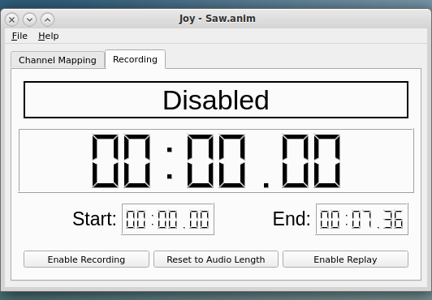

<!-- john Wed Mar 26 11:37:32 AM PDT 2025  -->
<!-- This software is made available for use under the GNU General Public License (GPL). -->
<!-- A copy of this license is available within the repository for this software and is -->
<!-- included herein by reference. -->

<a name="top">
&nbsp;
</a>

# joysticking QuickStart

joysticking is a utility intended to work in conjunction with Hauntimator
for rapidly populating digital and servo channels with gross movements
and actions.  It utilizes one or more joysticks that provide numeric data
via the axes and digital data via the buttons and populates the channels
as the joystick(s) are activated.  The general usage is:

+ Load an Animation File
+ Map Controls to Channels
+ Set Active Time Range
+ Record Channels
+ Play Back Recorded Activities
+ Save the Resulting Animation Data

## Load the Animation File (Required)

joysticking requires a preexisting animation file created by Hauntimator.
This file specifies all the possible channels that may be controlled and
recorded.  The animation file may be specified on the command line at
startup using the -a option or may be loaded from the File menu.

Go to File->Open Anim File to bring up a file browser.  Select the
desired animation file, with extension .anim, and click Open.

## Map Control to Channels

joysticking requires the use of a button on an attached joystick for
enabling recording and playback.  My preference is to hold the joystick
in one hand with my finger over the trigger button while activating the
other joystick controls with my other hand.  Unless you are very 
experienced, it is difficult to control more than three axes and one or
two buttons with one hand.  Thus, you may often find yourself performing
multiple recording passes to record more channels than can be easily
recorded in a single pass.  Alternatively, you may wish to enlist more
than one person to control as many channels as you wish with multiple
joysticks.  That's up to you.

In any case, one button on one joystick enables recording and playback.
This button must be selected to enable recording.  On the Record Button
Mapping tab under the Channel Mapping tab the user must select a joystick
and a button to initiate recording and playback.

Note that the joystick dropdown is always initialized to the first found
joystick, the only one if there is a single joystick attached.  The
button dropdown is populated when the joystick is selected to match the
available buttons on that particular joystick.  Always select the joystick
first so the button dropdown is populated correctly.

The user must select a button to enable initiation of recording.  This can
be done by selecting any of the button indices in the dropdown menu.  However,
the specific button to index mapping may not be obvious.  In this case, merely
position the mouse cursor on the button dropdown and then press the desired
button on the joystick.  This will select the appropriate index.  This feature
works on all the button dropdowns.

Next, select the Numeric Channel Mapping tab.  This tab will be populated with
joystick and axis dropdowns for all the numeric channels in the animation
file.  Select the joystick and axis for each channel you wish to record.  Do
not select axes for more channels than you can control.  If you are unsure of
which axis goes with which index, position the mouse cursor over the axis
dropdown and then move the joystick along the desired axis to the limit.  This
will autoselect the appropriate axis.

Next, select the Digital Channel Mapping tab.  This tab will be populated with
joystick and button dropdowns for all the digital channels in the animation
file.  Select the joystick and button for each channel you wish to record.  Do
not select buttons for more channels than you can control.  If you are unsure of
which buttons match which index, position the cursor over the button dropdown
and press the desired button on the joystick.  The index will be autoselected.

Once all the desired mappings have been specified, the mapping may be saved to
a file via the File->Save Map File option.  This file may then be loaded later
via the -t command line option at startup or via the File->Open Mapping File
option.  It is important to note that the mapping table is by index.  If the
next session switches or removes joysticks or the joysticks have different buttons,
the mapping file will generally be useless.

## Set Active Time Range

Once the channel mapping is complete, recording or playback may be initiated.
Switch to the Recording tab to perform this action.  By default, the time range
is initialized to the length of the audio file specified in the animation file.
The start and end times may be changed by double-clicking on the start and end
time widgets and entering a new time.  This time may be entered as a floating
point number of seconds or as minutes and seconds separated by colons.

Note that it is possible to set the end time to a value after the end of the
audio and joysticking will record or play to that time.  However, the start
time may not be set to a value less than zero and the audio always starts at
zero.

## Record Channels

To enable recording, click on the Enable Recording button.  If it is grayed out
it indicates that the record button has not been selected via the mapping.  For
safety, recording will not begin until the selected record button has been pressed.

It is quite possible to record channels without any visible feedback.  However,
for most of us it will be preferable to see the mechanisms moving as the controls
are activated.  For this, the controller must be attached to the computer via
USB and power must be on.  Further discussion will generally assume this is the
case.

While recording is enabled but prior to beginning recording, the joystick controls
may be activated to move the mechanisms to their initial state.

To activate recording, press and hold the selected joystick button.  The audio 
will begin to play, the time display will start counting, and the mechanisms
will move.  Any mechanisms that have data in their channels will be activated
even if they are not being recorded.  For those channels that have been mapped
to a joystick control, the states of the associated mechanisms will be recorded
into those channels.

Recording will continue until either the user releases the joystick button or
the end time is reached, whichever comes first.  Note that when recording 
terminates, recording is disabled.  You have to reenable it to record again.

## Play Back Recorded Activities

Playback works in a similar way to recording.  The user clicks on Enable
Playback, then presses and holds down the specified record button on the
joystick.  Playback will begin at the specified start time and run until the
end time is reached or the button is released.

If the Enable Playback button is grayed out, it indicates that joysticking
cannot connect to the controller, most likely because the USB cable is not
connected.  If the playback button is active but nothing seems to happen, it
may be because no data has been recorded in any channels or the controller may
not have the external power it needs to drive the mechanisms.

## Save the Resulting Animation Data

To save your current animation, with the control
channels, use File->Save or File->Save As to bring up a file browser
to select a filename and path to save your work.  It is often a good idea to
save the animation data to a new file for validation rather than writing over
your existing animation file.  Save As will do this and keep the filename so
additional Save actions will continue to write to the new file.

To save the channel mapping to joystick controls, use File->Save Map File to
select a file to save to.  Since the user may want different mappings for
different purposes, Save Map File always prompts for a filename to map to
rather than defaulting to any previously used filename.

---

Copyright 2025 John R. Wright, William R. Douglas - 1031_Systems
