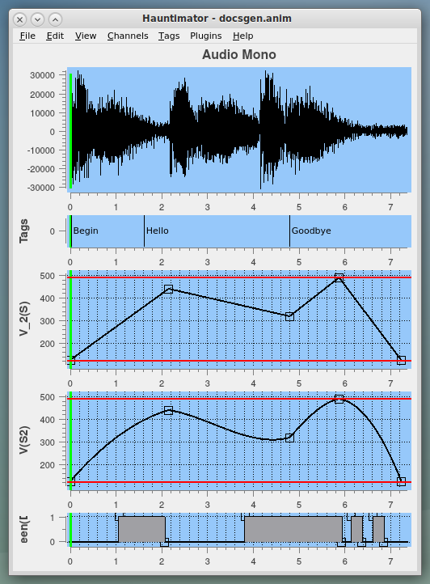
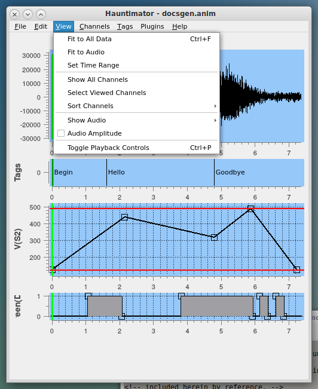
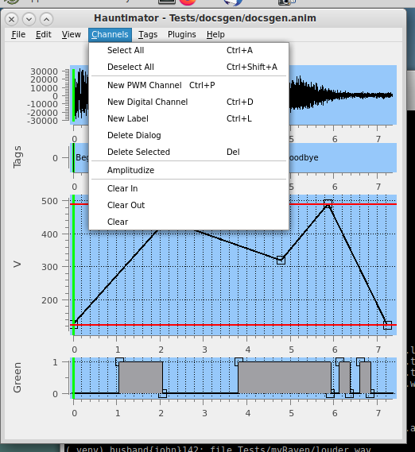

<!-- john Fri Jun 27 07:35:16 PDT 2024 -->
<a name="top">
&nbsp;
</a>

# Help for Hauntimator.py

1.0.0(b)

Hauntimator.py, as you might surmise, is a Python program.  Its general purpose
is to synchronize control signals for animatronics and lighting to each other
and to an audio track.  Hauntimator provides the means for visualizing and
listening to an audio track and then creating and editing control channels
for individual mechanisms in sync with the audio.  Control values are then
output to the hardware controller to operate the mechanisms.

+ A. [Process](#process)
+ B. [Overview](#overview)
+ C. [Menus](#menus)
+ D. [Audio Tracks](#audio-tracks)
+ E. [Channel Panes](#channel-panes)
+ F. [Specialized Tools](#specialized-tools)
+ G. [Requirements](#requirements)
+ H. [Known Issues and Bugs](#bugs)

<a name="process">
&nbsp;
</a>

## Process

The Hauntimator process is similar to that used by other tools that perform
similar functions.  Generally it is preferred to synchronize mouth, face,
and head movements to audio containing voices, then proceed to synchronize
other movements, lighting controls,  and other activities to the audio.

1. Using an audio editor, create sound files for each character’s dialog, and a separate mix file which contains all of the characters, effects, and background music.
2. Start Hauntimator.
3. Load an audio file to work with
4. Generate the mouth control channel(s).
5. Generate the head motion control channels.
6. Generate the remaining servo and motor channels.
7. Program the lighting channels.
8. Output the control information for use by the hardware controller.

<a name="overview">
&nbsp;
</a>

## Overview

The Hauntimator GUI consists of, from top to bottom, a menubar, audio channel displays,
and control channel displays called panes.  When the user loads an audio file into Hauntimator
it is displayed using one pane for mono or two panes for left and right stereo.  It is not
necessary for there to be an audio file in use and none will be displayed in that case.

The Hauntimator User Interface

The user then begins to create control channels as desired.  Each channel is named and
will usually be accompanied by metadata including minimum and maximum limits, hardware
port number, control type, and channel type.  These may be specified at creation time or
set or updated later.

Next, the user begins populating one or more channels, either manually or using a helper
tool, with knots representing the state of the controlled mechanism at a specific time.
The user then plays the audio and watches the channel pane to determine how well the
controls follow the audio.  Individual knots may be dragged around to improve the quality
of the synchronization.

Each control channel supports one of two types of hardware controls, either a digital
on/off control typically used for lighting or a numeric value that may be used for servo
positioning, motor speed, brightness, or other types of continuous control.  Hauntimator
does not distinguish the purpose of the channel other than by name so a numeric channel
may be used to control servos via PWM, motors via CAN, and other mechanisms based
entirely on the controller hardware.  However, for better performance of the software
within the controller hardware, Hauntimator sends integer values for all channels.  These
are either 0/1 for digital channels or 0-4095 (user-controllable) for servo channels.

For the numeric channels, Hauntimator supports different types of interpolation between
knots.  The simplest is Step that makes a step transition from one value to the next,
thus holding a set value until the next knot time is reached.  The most common type is
Linear that follows a straight line from knot to knot.  Another
common type is Spline that applies a smoothing interpolation between points for
possibly better appearance.  The example image above shows the appearance of a Linear
channel and a Spline channel.

As the user populates channels, completed channels may be hidden so focus can be on the
current channel under construction and any other channels that may be relevant or helpful.
Channels are ordered on the display initially in the order of creation from top to bottom.

The length of the audio generally determines the length of the animation.  (Although it is
possible to circumvent this limitation, most of this discussion will assume such.)  In
general, particularly once the user is working on the full audio, it will be challenging
to distinguish the synchronization of the knots with the audio.  Thus, the user will
want to zoom in to a smaller subrange of the overall duration to construct, visualize,
and modify the control channels.  Users may do this manually by clicking and dragging
within an audio pane, by setting limits by current playback position within the audio,
or by selecting a range from a markdown entry.  [See here for zoom details.](#zooming)

Once the user has completed some or all of the channels, they may output the control
information to a hardware controller.  This may be done by exporting a CSV file that
contains values for all the channels at a specific timestep (typically 20msec or 50Hz
for PWM servo control).  This file is transferred to the controller via flash drive
or other method and the controller processes it.  Note that channels that do not have
assigned port numbers will not be written to the CSV file.

Hauntimator is intended to be agnostic to the specific hardware controller the user
chooses.  It has been tested with a Raspberry Pi Pico and a Pico clone running
MicroPython but not with any other devices.  Details of how Hauntimator communicates with
the controller is bundled within a commlib.py file specific to the controller and
compatible with the python code running on the controller.  For users with other
types of controllers, they can use the Pico-specific examples included with Hauntimator
to customize the interface for other systems.  Information on all that may be found
elsewhere.

<a name="menus">
&nbsp;
</a>

## Menus

Hauntimator has a number of dropdown menus available on the menubar at the top
of the Hauntimator main window or at the top of the screen in MacOS.  They are:

1. [File](#file) - to save and load your work
2. [Edit](#editmenu) - to add and delete channels or edit metadata
3. [View](#view) - to fit data to the screen or hide channels currently unneeded
4. [Channels](#channels) - to select, copy, and paste channels
5. [Tags](#tags) - for Tag-related activities
6. [Plugins](#plugins) - to run external tools
7. [Help](#help) - to find out more

<a name="file">
&nbsp;
</a>

### File Menu

The File menu contains the following options:

+ New Animation - Discard current animation and start from scratch
+ Open Anim File - Open and Load an existing animation file
+ Open Audio file - Open and attach audio file to the current animation (.wav only)
+ Merge Anim File - Open an existing animation and merge with current one
+ Save Anim File - Save the current animation to the file it was loaded from
+ Save As - Save the current animation under a new filename
+ Export - Export to an alternative file format or send to controller
+ Quit - Duh!

Hauntimator tries to be careful about quitting without saving or overwriting files.

The Export option is generally used to upload the control file to the controller.
To accomplish, the file is written as a CSV (comma-separated values) file and then
copied to the controller.  If the copy is successful, the local CSV file is
deleted.  The Export to CSV option will write a file for the user to peruse that
should be identical to the one uploaded.  The CSV file is sampled at the rate
specified in the Preferences, generally 50Hz.

<a name="editmenu">
&nbsp;
</a>

### Edit Menu

The Edit menu contains the following options:

+ Undo - Undo the last editing action
+ Redo - Redo the last editing action that was undone
+ New Numeric Channel - Add an empty servo channel to the animation
+ New Digital Channel - Add an empty on/off channel to the animation
+ Delete Channels - Bring up a channel selector to select and delete multiple channels
+ Edit Servo Data - Edit table of available known servo types and associated data
+ Edit Metadata - Edit some numeric data for the animation
+ Edit Preferences - Edit the preferences settings for Hauntimator

Hauntimator comes with a list of known servo types typically stored in a file named servos.csh.
Each entry specifies the range of motion of that type of servo and its duty cycles.  This
information is used to limit the control outputs appropriately.  New servo types may be
added to this list (and automagically stored) as desired and existing servos may have
their data changed.

Each animation comes with some simple metadata that includes the start time (usually 0.0),
the end time (usually unspecified), and the sample rate (usually 50Hz).  Usually, the
animation playback will begin at time 0, which is when the audio will begin to play.
The metadata can be used to change some behaviors but has not been well-tested so
caveat emptor.  This is discussed in more detail [here](#timeranges).

The Preferences specify general information that Hauntimator uses.  Some if this is related
to the hardware being controlled, some controls display functionality, and some relates
to files and communication.  The individual preferences are:

+ MaxDigitalChannels - The maximum number of digital channels supported by the hardware.  If the user has installed some number of 74HC595N chips in their hardware, there will be 8 available digital channels per chip.  The port numbers for digital channels begin at MaxServoChannels and counts up from there.
+ MaxServoChannels - The maximum number of servo channels supported by the hardware.  If
 the user has installed some number of PCA9685 boards in their hardware, there will be 16 available servos per board.  The port numbers for servo channels begin at 0 and count up.
+ ServoDefaultMinimum - If the user has installed PCA9685 boards in their hardware, they expect values in the range 0 to 4095 for servo control.  Other boards may use other values.
+ ServoDefaultMaximum - If the user has installed PCA9685 boards in their hardware, they expect values in the range 0 to 4095 for servo control.  Other boards may use other values.
+ Ordering - This controls the display of channels in the Hauntimator main window.  The channels may be ordered, from top to bottom, in Alphabetical order by channel name (makes them easy to find), in Numeric order by port number (nicely separates servo and digital channels), or in the order the channels were created.
+ AutoSave - Controls saving of the animation every time an edit is made.  The saved copy of the animation is stored in a file with the same name as the animation with ".autosave" appended or in a file named "unnamedfile.anim.autosave" if the animation has never been named.
+ ShowTips - Controls the use of popup tool tips within Hauntimator.  Beginning users may find the popup tips helpful while an experienced user may find them bothersome.  Some go away automatically so hopefully they will not probe to be obnoxious.
+ ServoDataFile - The name of the file containing known servo types and their associated information.  The user may rename this file or move it so the preference allows that.
+ UploadCSVFile - The name of the CSV control file as it is used in the controller software.  The Pico software that accompanies the Hauntimator and is run on the Pico looks for a particular file and this must match that.
+ UploadAudioFile - The name of the audio file as it is used in the controller software.  The Pico software that accompanies the Hauntimator and is run on the Pico looks for a particular file and this must match that.  Originally, Hauntimator was empowered to upload the audio file but this can be problematic and very time-consuming so that feature is currently disabled.  The supporting preference is still there for later use.
+ TTYPortRoot - This is the name of the communications port to use to talk to the controller when it is plugged into the USB port on the computer that Hauntimator runs on.  Under linux, this is typically /dev/ttyACM0.  On a Mac it is more like /dev/tty00bb10.  Under Windows it is something I don't care about.

<a name="view">
&nbsp;
</a>

### View Menu

Hauntimator is designed to support a large number of digital and servo channels over a long
range of time.  Typically, however, the user will work on a small number of channels
over a short span of time, then move to the next section to focus on.  The View menu
is designed to aid in this process.  The View menu contains the following options:

+ Fit to All Data - Fit all audio and channel data to the current window width.  This essentially undoes all zooming.
+ Fit to Audio - Fit the audio to the current window width, hiding any part of the channel data outside the timespan of the audio.
+ Fit to Time Range - Fit the full time range specified in the animation metadata to the window.
+ Show All Channels - Make all channels visible within the window.  This may make the channel panes microscopically small.
+ Select Viewed Channels - Brings up a selection widget for selecting channels to be visible or hidden.
+ Show Audio - Controls the display of audio channels.
+ Audio Amplitude - Controls display of audio as amplitude rather than waveform.
+ Toggle Playback Controls - Reveals or hides Stop/Play/Rewind controls for playback.

<a name="zooming">
&nbsp;
</a>

The View menu mostly unzooms the display.  To zoom in to a particular time range, there are
several methods available.  The fastest, wildest, least specific method is to click and
hold the left mouse button within the audio pane (either if stereo) and drag.  If the 
cursor is dragged up or down, the entire display zooms in or out around where the user
clicked.  If the cursor is dragged left or right, the entire display pans left and right.
The user may quickly select a reasonable time range upon which to work.

A second method for selecting a smaller time range is to reveal the playback controls
and use Set Left and Set Right buttons.  The user can hit Play and at the desired start
time hit Set Left.  This will immediately set the left edge of the displayed time range
to the playback time when Set Left was clicked.  Set Right does the same thing to the
right edge of the displayed time range.  The user may stop playback before hitting Set
Left or Set Right.

A third method is supported by tags within the animation.  Clicking the left mouse
button on a tag within the tag pane while holding down the Ctrl key will zoom the
display to the duration of the tag.  See the [Tag Menu](#tags) for more details
on the use of tags.

<a name="timeranges">
&nbsp;
</a>

A note on time ranges might be appropriate here.  The time range for an animation comes from
any of several sources and is closely coupled with the hardware controller and its embedded
software.  Generally, the controller will play an animation until both its audio tracks and
its control file have completed playing.  If there are seven seconds of audio and ten
seconds of animation control, it will play for ten seconds.  If there are seven seconds of
audion and five seonds of animation control, it will play for seven seconds.  Thus, the
playback duration is set by the longer of the audio or the CSV file containing the control
values.

Time range within Hauntimator generally refers to the length of the control data in the CSV
file that Hauntimator will export to the controller.  If the user does nothing special, this
will be from time 0.0 to the time of the last control point in any of the control channels.
Each animation starts at time 0.0 in all cases.  The user cannot override the start time for
the animation.  However, the user may override the end time.  In the metadata for the animation,
there is an editable field containing the End Time for the animation and the user may set this
as desired to any value greater than 0.0.  Once the user does this, Hauntimator will output a
CSV control file beginning at time 0.0 and going to the end time set by the user regardless
of the range of the control data.  The "Fit to Time Range" menu item will fit the specified
time range to the current window.  The animation metadata is accessed from the [Edit menu](#editmenu).

The user may undo setting the end time via the standard ctrl-Z mechanism or, if too late for
that, by entering a negative number for the end time and saving the metadata.

<a name="channels">
&nbsp;
</a>

### Channels Menu

The Channels menu is used for operations on channels.  The options are:

+ Select All - Select all channels
+ Deselect All - Deselect all channels
+ Selector Pane - Bring up a pane for selecting and deselecting channels of choice
+ Copy - Copy a single selected channel to the Clipboard
+ Paste - Paste the clipboard into a single selected channel
+ Amplitudize - Fill all selected channels with data points that follow the amplitude of the audio
+ Shift - Shift data points in selected data channels in time
+ Delete - Delete all selected channels after confirmation

The copy and paste operations have hot key shortcuts, ctrl-C and ctrl-V respectively.  This allows
quick copy and paste operations without selecting channels.  If no channel is selected, by default the
Copy operation copies any channel under the current cursor position.  Similarly, if no channel is
selected, the Paste operation pastes into the channel under the current cursor position.  If the
cursor is not within a channel pane, no operation occurs.  Doing a copy and paste pastes the data
points and some but not all metadata.  Thus channel names and port numbers are preserved while data
min and max values are updated.  This can be very problematic if copying from a servo channel to a
digital channel or vice versa and is not recommended.

The Amplitudize function fills the channel with data points based on the amplitude of the audio signal.
By default, it only fills the visible part of the channel but the user may change that as well as the
sampling rate of the new data points.

The Shift function is not yet implemented.

The Delete function requests confirmation prior to deleting.  This is because it is difficult but
possible to select and then delete a channel that is hidden.  Of course the delete may be undone.

<a name="tags">
&nbsp;
</a>

### Tags Menu

Tags are text labels for key points in the animation.  They may be simple strings like "A", "B", "C",
or more descriptive, or represent the dialogue in the audio.  There are multiple ways to add tags to
the animation and some helpful uses for them.  The Tags menu contains the following options:

+ Insert Tag - Insert a tag at the current playback time (designated by the green bar)
+ Tag Selector - Brings up a widget for selecting a tag
+ Import Script - Reads a script file and create tags
+ Toggle Tag Pane - Toggle visibility of the Tags pane
+ Clear All Tags - Delete all tags and clear the Tags pane

The Insert Tag (ctrl-T) inserts a tag at the current playback time unless a tag is already located at
that time.  If the tag may be inserted, a popup prompts for the text for the tag.  Tags may be inserted
at any time by clicking the left mouse button while holding down the shift key anywhere within the Tags
pane.  Again a popup prompts for the text for the tag unless the selected time exactly matches that of
another tag.

If the cursor is on the bar designating a tag in the Tags pane, the ctrl-T hot key will select that tag
and zoom the display to the time range of that tag to the next tag rather than inserting an additional
tag.

The Tag selector popup provides a scrollable list of all the tags in the animation with their times.
Clicking on any tag zooms to that tag.

Tags may be deleted by left-clicking on the bar designating the tag in the Tags pane while holding down
the shift key.  This is cumbersome if you want to delete many but is the only method available now.

Tags may be shifted in time by left-clicking on the bar designating the tag in the Tags pane and sliding
left or right.  Currently, only one tag may be shifted at a time.

The Import Script function provides the capability of importing a script file containing the dialogue
contained in the audio.  Each line in the script file becomes an individual tag with the line of text as
the tag's text.  The tags are spaced by a simple algorithm based on the number of characters so as to
maybe approximately align with the spoken dialogue but many shifts are generally required for good
alignment.  

The Phonemes plugin also offers a way to populate the Tags pane.  See the plugin help for more details.

<a name="plugins">
&nbsp;
</a>

### Plugins Menu

The Plugins menu provides access to external functions implemented in Python and installed in the
plugins directory.  Each entry in the Plugins menu refers to one Python file in the plugins directory
and the dropdown menus then access the individual functions provided.  There is one standard set of
plugins provided in the Stock entry.  This implements some useful tools that might be considered
standard to Hauntimator.  There is also a Phonemes plugin provided that is activated if the
pocketsphinx module is installed.  Users may develop or download other plugins at their
convenience.  If Hauntimator does not find a plugins directory to does notfind any suitable Python
files within the plugins directory, the Plugins menu will not appear.

Generally, the Stock plugins operate on the currently selected knots and channels.  However, plugins
have access to pretty much everything in the animation and can mess things up willy-nilly.
Hauntimator does provide Undo capability for plugin actions.

<a name="help">
&nbsp;
</a>

### Help Menu

The Help menu provides access to this helpful information as well as some other helpful information.
In addition, it provides some visibility into the content of the clipboard and the overall animation as
expressed in the XML used for storing the animation information.  This is mostly for my personal
debugging purposes but is available for all to peruse.

If the developer or user have provided help files for the plugins (plugins/plugin_name.md), they will
be automagically added to the Help menu.

<a name="audio-tracks">
&nbsp;
</a>

## Audio Tracks

Currently Hauntimator and the Raspberry Pi Pico system support only .wav (PCM) audio, either mono or stereo.
Hauntimator runs on your desktop or other higher-powered system so it can handle higher sample rates such as
44,100Hz.  However, the Pico can only handle sample rates of 11,025Hz, 16-bit in stereo primarily due to
slow read times from the SD card.  MP3 libraries for the Pico's Micropython are not yet available so the
I/O cannot easily be reduced.  This generally requires that the user use a desktop tool such as ffmpeg
to downsample any audio and convert it to .wav format prior to loading on the SD card for the Pico.

When displaying the audio tracks in Hauntimator, the display detects mono or stereo and displays all the
tracks available.  The user may optionally hide one or both tracks.  This may be useful if the dialogue
for a character is in one track only.  Currently, the system only supports one stereo audio feed that
could support two character's dialogue.  Dialogue for additional characters will require additional
Pico systems and separate animation control files.

Audio channels may be displayed as waveforms or as amplitude and control channels may be autogenerated
from the amplitude.  This can be used to open a mouth more for louder sounds and less for quieter sounds.

<a name="channel-panes">
&nbsp;
</a>

## Channel Panes

The channel panes contain plots of the data used to control each channel of the controller.  The channels
generally either control servos or digital, on/off signals although there is some support for more general
numeric controls.  Each pane displays the data points, interpolating curves between the data points,
specified limits, and the current playback time.  The data points are enclosed in small squares to allow
the user to easily select them and also identify their position.  Generally, the data points may be inserted
by shift-left-click within the pane and then dragging to the desired position.  Shift-left-click on an
existing point deletes it.  Existing points may be edited
by left-clicking within the square and then dragging the point to its desired position.

Servo/numeric channel panes display red bars to indicate the minimum and maximum allowed values for a 
control point.  Attempting to place a point outside the range will place it at the nearest limit.  Digital
channels are always ranged from 0 to 1 so the limits are not explicitly displayed.  Shift-left-clicking
in a digital channel pane will place the point at the nearest limit, either 0 or 1.

The displayed vertical range of the channel pane can be adjusted by rotating the mouse wheel with the
cursor within the pane.

The right mouse button brings up a submenu for working with the specific channel.  This submenu contains
the following entries:

+ Metadata - Brings up a secondary dialog for editing all the metadata for the channel except the channel name.
+ Invert - Inverts (flips vertically) the channel points, useful for two servos operating the same joint but mirrored.
+ Randomize - Fill the channel with randomly generated values at a specified sample rate.
+ Rescale - Fit the upper and lower data limits to the displayed pane.
+ Hide - Remove the pane from the display.  It can be redisplayed via the [View menu](#view).
+ Delete - Delete this channel from the animation.  Confirmation is requested and can be Undone.

### Metadata

The channel metadata is additional information used for properly controlling the hardware driven by that
channel and for aiding the user in interacting with the channel and associated hardware.  The metadata
includes a name for the channel (which must be unique) and a port number that the controller software
associates with a pin or bit or something to drive the correct hardware.  In addition, the servo channels
also contain a servo type, an interpolation type, and upper and lower limits.  The interpolation type
may be Linear, Spline, or Step.  Linear indicates that the channel values driving the animation will
follow straight lines from one control point to the next.  Spline causes the control points to be more
smoothly interpolated.  Step causes the control value to step up or down instantly to the new value.
Note that Step may not be usable for servos.

The limits on a servo channel are initialized to what the type of servo, if specified, can handle.  If the
user clicks on the Servo selector, a list of known servo types will appear.  If the user selects one, the
upper and lower limits are set to the maximum limits for that type of servo.  Note that the Preferences
also come into play in a manner that is hardware-specific and discussed elsewhere.

Often, the actual animatronic figure may have a reduced range of motion and the limits should be adjusted
to prevent the user from overdriving the servo.  Hauntimator provides a live, interactive control paradigm
for a servo or digital channel.  Clicking the Interactive button brings up another widget customized either
for controlling a digital channel or a servo.  For a digital channel, the widget supports turning the
channel on or off for testing.  For a servo, the widget supports a slider that may be used to set the 
servo interactively if the Live toggle is set.  The user may click the Page Up and Page Down keyboard
buttons to jump or the Up and Down Arrow keys to single step up and down to set the servo to a desired
limit and then the Max or Min button can be clicked to set that limit to the current servo value.

<a name="specialized-tools">
&nbsp;
</a>

## Specialized Tools

A few specialized tools for aiding in the generation of control channels have been implemented
within Hauntimator, as well as some still on the drawing board.  Implemented tools, generally
introduced elsewhere in this document, include random and amplitude-based control point
generation and inversion of control channels as well as audio-to-phoneme-to-control
point tools.

Random control points may be useful for motions that are not particularly coupled to the
audio such as moving the head/gaze around.  For motions that are coupled to the amplitude of
the audio, such as how far the mouth is open, the Amplitudize tool may be used to generate
points that are proportional the audio amplitude (note that the audio amplitude may be directly
visualized in the audio pane via the View->Audio Amplitude option).  Both random and amplitude
modes accept a start and end time, defaulting to the currently displayed range, and a sampling
rate and populate the channel(s) accordingly.  Note that Randomize applies to the channel pane
corresponding to the channel menu popup so only a single pane is affected.  Amplitudinize is
applied to all selected panes.  Behavior in Digital channels is reasonable in that either a
series of random transitions are generated (some may not actually change the state) or the
channel is on when the audio amplitude is above average and off when below average.

Sometimes, multiple servos may be required to move part of the animatronics.  For example,
a jaw may be hinged on both sides of the skull and a servo may be attached to each side.  In
such a case, the servos may be mounted in a mirror image configuration.  To simplify using
this configuration, the Invert tool may be used.  Create a channel for one servo, then copy
it to a new channel and use the Invert tool in the channel popup menu to invert it.  Then the
two servos will work in unison with each moving opposite of the other.

Some phoneme-based tools are available to truly assist in syncing
voices to animatronic behavior.  The main one is available via the Phonemes plugin on the
plugins menu.  It analyzes an audio file containing voice only and populates a control 
channel with knots for a particular type of motion such as jaw, lips, or cheeks.  See
the specific Help for the Phonemes plugin for more information.

<a name="requirements">
&nbsp;
</a>

## Requirements

Hauntimator uses PyQt and PythonQwt libraries for its graphical user elements.
Use of the Phonemes plugin requires installation of pocketsphinx.  

I like to use rshell
and generally install it with Hauntimator but it is not required.  It or thonny may also
be installed and used elsewhere for transferring files to and from the controller.  Some
such tool is required outside of Hauntimator to install the various software modules on
the controller.

<a name="bugs">
&nbsp;
</a>

## Known Issues and Bugs

There is a known Qt5 bug that causes a message of the form "qt.qpa.xcb: QXcbConnection: XCB error: 3 (BadWindow), sequence: 8564, resource id: 10598470, major code: 40 (TranslateCoords), minor code: 0"
to be output to stderr whenever certain types of windows close.  This seems to
be ignorable.

Some users may use thonny or rshell to upload files to the controller.
Playing the animation in the controller puts it in a state where uploading a control
file is now impossible via rshell and probably thonny.  The user will have to reset
the controller, generally by unplugging it from the USB port and plugging it back in
or by pressing a reset button found on some clones.
Uploading the control and audio files was changed to not use rshell so this problem is
generally obviated when done from inside Hauntimator.  (I strongly suspect this has
something to do with running multiple threads, one for control and one for playing
audio.  If no audio has been played, rshell and thonny can connect fine.  There may be
a way around this but I haven't found it yet.)

Conversely, rshell and thonny interrupt the controller when transferring files to or
from it.  This disrupts the communication between Hauntimator and the main software
running on the controller.  Again the user will need to reset the controller and
allow the main program to start to let Hauntimator reenable communications.

The Raspberry Pi Pico used for development and testing has a limited ability to
support this functionality, primarily in the use of an SD card.  In general, the
audio track needs to be sampled at 11025 Hz or lower in stereo 16-bit mode or
22050 Hz in mono 16-bit mode due to the slowness of reading from the SD card.
Higher sampling rates lead to breakups and skips in the audio playback.  Additionally,
putting the control file on the SD card is problematic due to the audio playback
taking all the read cycles.  Thus, generally the audio is stored on the SD card at
a lower sample rate and the control file is stored in the limited flash memory.
Smaller animations of a few seconds may be stored completely in flash memory and
do not seem to suffer the same problems.  Pico clones with larger flash memory
may also be used.
An animation controlling 16 servos and 16 digital channels requires around 7kB per
second of animation so a maximum of 2 to 3 minutes of animation may be stored in
the Pico's 1 MB or so of available flash.

In addition, the python code running on the Pico uses two threads, one for audio
playback and one for animation control.  This requires MicroPython be installed.
Using CircuitPython or C or other embedded environment will change things.  Your
mileage will vary.  Hauntimator has been tested with MicroPython only.

***

Copyright 2024 John R. Wright, William R. Douglas

