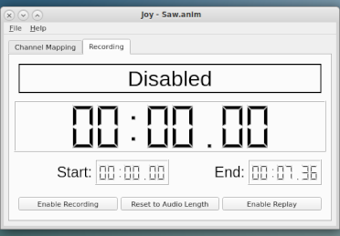

<!-- john Fri Jun 27 07:35:16 PDT 2024 -->
<!-- This software is made available for use under the GNU General Public License (GPL). -->
<!-- A copy of this license is available within the repository for this software and is -->
<!-- included herein by reference. -->

# About Joysticking.py

A tool for creating channels for Hauntimator with a joystick.

1.0.0(b)

Copyright 2025 John R. Wright, William R. Douglas - 1031_Systems

